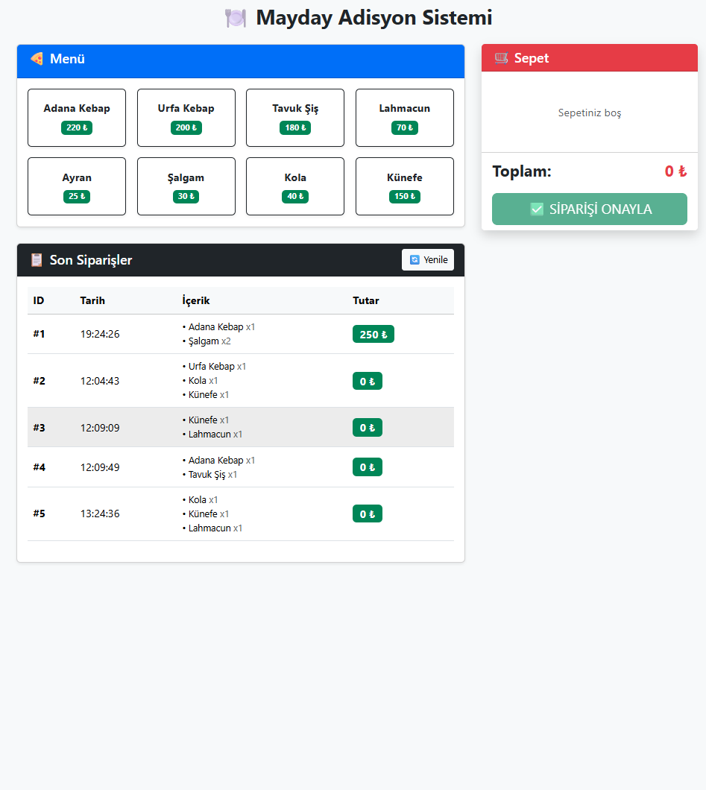
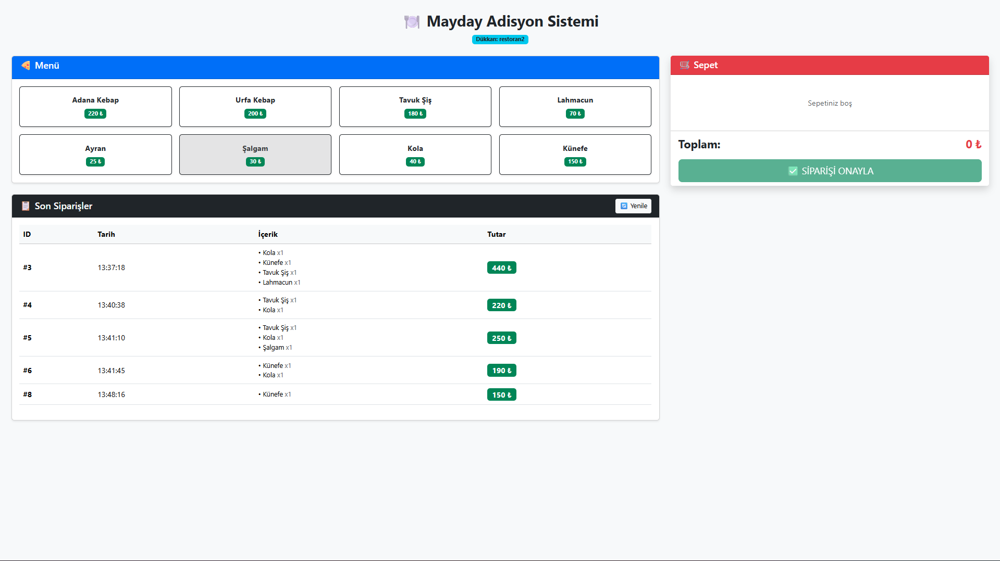
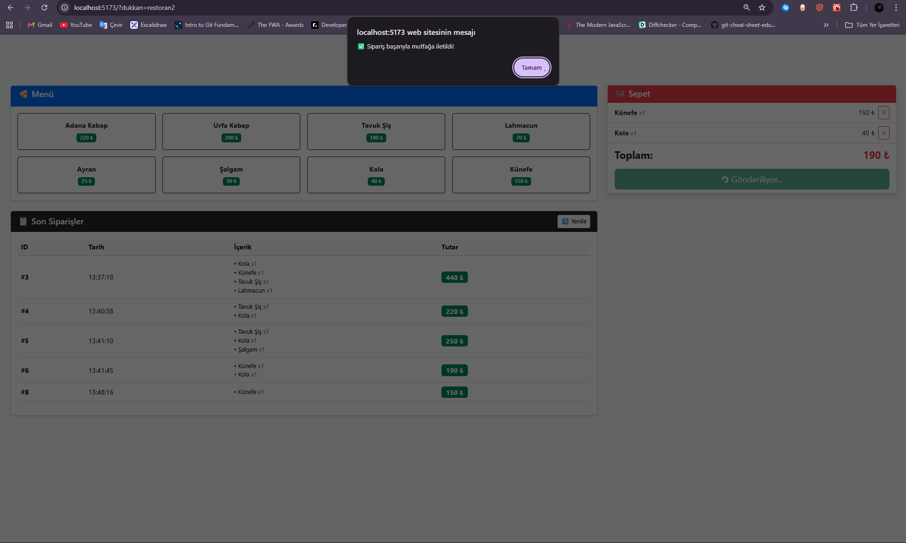

# 📦 Mayday Sipariş Yönetim Modülü

Bu proje, **Mayday Yazılım** yetkinlik değerlendirmesi kapsamında geliştirilen "Mini Sipariş Yönetim Modülü"dür. Backend mimarisi en güncel **.NET 10** teknolojisi ile, Frontend arayüzü ise **React (Vite)** ile geliştirilmiştir.

---

## 🏗️ Proje Mimarisi ve Teknolojiler

Proje, **Multi-Tenant (Çoklu Kiracı)** yapısına uygun, ölçeklenebilir ve **Clean Architecture** prensipleriyle tasarlanmıştır.

### Backend
- **.NET 10 Web API**: Yüksek performanslı RESTful servis yapısı (Latest STS/LTS)
- **Entity Framework Core**: Modern ORM aracı
- **SQLite**: Veritabanı (Hız, taşınabilirlik ve yerel ortamda kurulum gerektirmediği için tercih edildi)
- **Middleware Logging**: Gelen isteklerin (Request) konsol üzerinde renkli ve detaylı takibi
- **Swagger**: API dokümantasyonu ve endpoint testleri

### Frontend
- **React (Vite)**: Modern, modüler ve hızlı arayüz geliştirme ortamı
- **Bootstrap 5**: Kullanıcı dostu ve responsive (mobil uyumlu) tasarım
- **Fetch API**: Asenkron veri yönetimi ve Backend haberleşmesi

---

## ✨ Öne Çıkan Özellikler

### 🏢 Multi-Tenant Veri İzolasyonu
Sistem, tek bir veritabanı üzerinde birden fazla restoranı (tenant) izole şekilde yönetir. Her restoran sadece kendi siparişlerini görür ve yönetir.

### 🎯 Dinamik Dükkan Simülasyonu (URL Parametresi)
Proje, herhangi bir giriş ekranı (Login) olmadan kiracı ayrımını simüle edebilir. Varsayılan olarak "restoran1" verileri yüklenir. Adres çubuğuna `?dukkan=starbucks` gibi parametreler girilerek farklı bir işletme gibi davranılabilir ve veri izolasyonu test edilebilir.

### 📋 Modern Sipariş Yönetimi
Görsel menüden ürün seçimi, sepet yönetimi ve sipariş onayı.

### 💡 Kullanıcı Deneyimi (UX) İyileştirmeleri
Veri yüklenirken kullanıcıya görsel geri bildirim (Loading States) ve hata durumunda net uyarılar (Error Handling).

---

## 📸 Ekran Görüntüleri

### Ana Sipariş Ekranı

*Menü, sepet ve sipariş geçmişi görünümü*

### Multi-Tenant Simülasyon (URL Parametresi)

*Farklı restoran görünümü - URL parametresi ile veri izolasyonu*

### Sipariş Onay Süreci

*Gerçek zamanlı sipariş onay ve loading state yönetimi*

---

## 🚀 Kurulum ve Çalıştırma

Projeyi yerel ortamınızda çalıştırmak için aşağıdaki adımları izleyin:

### Backend'i Ayağa Kaldırma (Terminal 1)

```bash
cd Backend
dotnet restore
dotnet ef database update
dotnet watch run
```

> Backend şu adreste çalışacaktır: `http://localhost:5xxx`

### Frontend'i Başlatma (Terminal 2)

```bash
cd Frontend
npm install
npm run dev
```

> Frontend şu adreste çalışacaktır: `http://localhost:5173`

---

## 🤖 Geliştirme Notları & AI Yaklaşımı

Bu proje geliştirilirken, modern yazılım mühendisliği pratikleri uygulanmış ve Yapay Zeka (AI) asistanlarından **"Pair Programmer" (Eş Programcı)** mantığıyla faydalanılmıştır.

- **AI Kullanımı**: Özellikle boilerplate (tekrarlayan) kodların yazımı, CSS düzenlemeleri ve hata ayıklama (Debugging) süreçlerinde AI araçlarından verimlilik desteği alınmıştır.
- **Mimari ve Mantık**: Projenin çekirdek mimarisi, veritabanı kurgusu, iş mantığı (Business Logic) ve Multi-Tenant yapısı tamamen geliştirici tarafından tasarlanmıştır.
- **Sürüm Tercihi**: En güncel teknolojileri deneyimlemek ve performansı artırmak adına Backend tarafında **.NET 10** tercih edilmiştir.

---

## 🧗 Zorlandığım Noktalar ve Çözümler (Challenges)

### Multi-Tenant Mimarisi ve Veri İzolasyonu
Başlangıçta her restoran için ayrı veritabanı mı yoksa ortak veritabanı mı kullanmam gerektiği konusunda mimari bir karar vermem gerekti. Projenin kapsamı ve performansı için **"Shared Database" (Ortak Veritabanı)** yaklaşımını seçtim ve verileri `TenantId` ile filtreleyerek izole ettim.

### Ortak ID Yönetimi (Auto-Increment)
Ortak veritabanı kullandığım için, Restoran A'nın siparişi ID:1 iken, araya giren Restoran B yüzünden Restoran A'nın bir sonraki siparişinin ID:5 olabileceğini fark ettim. Bunun bir hata değil, paylaşımlı veritabanı mimarisinin doğal bir sonucu olduğunu araştırarak öğrendim ve yapıyı buna göre korudum.

### Frontend ve Backend Senkronizasyonu
Sipariş gönderilirken (POST) oluşan asenkron bekleme sürelerinde kullanıcının tekrar butona basmasını engellemek için **"Loading" (Yükleniyor)** durumlarını yönetmekte başta zorlandım ancak State yönetimi ile bu akışı kullanıcı dostu hale getirdim.

---

## 🗺️ Gelecek Planları (Roadmap)

Zaman kısıtı sebebiyle prototipte yer almayan ancak planlanan özellikler:

- [ ] JWT (JSON Web Token) tabanlı güvenli kimlik doğrulama
- [ ] Sipariş durum yönetimi (Hazırlanıyor, Yolda, Teslim Edildi)
- [ ] Kapsamlı Unit Test (Birim Testleri)

---

## 👨‍💻 Geliştirici

**Mehmet Sönmez**

---

## 📝 Lisans

Bu proje Mayday Yazılım yetkinlik değerlendirmesi kapsamında geliştirilmiştir.
